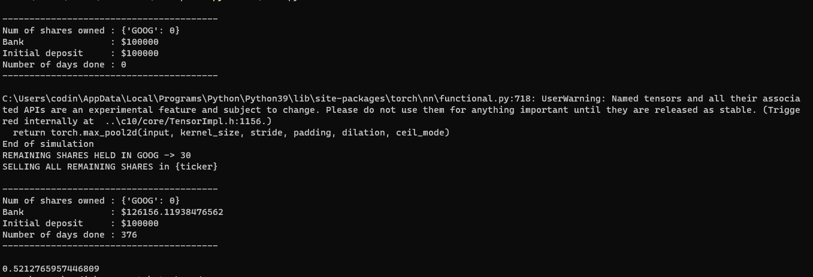

# Stonks prediction

Predicting stock price trend with Neural networks

## Data Preparation

1. Get S&P 100 tickers -> `python download_data.py`
2. Make dataset -> `python make_data.py`
3. Remove NaN values from dataset -> `python remove_nan.py`
4. Handle imbance -> `python remove_imbalance.py`

## Training
`python trainconv.py`(manages to reach 99% accracy on test data)
`python test.py` (backtest)

## Approach
### Problem
Trying to forcast stocks

Some problems faced:

 1. Stock price keeps increasing with time
 2. So much volatility
 3. Picking the right features

For problem 1, the solution I thought of was to predict the next close price **relative** to the previous n prices.

That still flunked tho.

For problem 3, After some data analysis, I found out that volume wasa negatively correlated to the stock price.

So, volume could be useful in predicting stock returns / prices

### Approach 1 - predicting stock returns

LSTM's and  MLP's gave really poor results predicting the returns (prolly cos of the volatility)

### Approach 2 - predicting trend with convnet
I thought this would be significantly easier for the model.

It's phased as a classification problem

1 if up in the next n days else 0

the input the model is close and volume data from the past 16 days.

the time window for the close and volume is normalized between zero and one.

it is then reshaped to a (2,8) matrix

the close and volume is then combined to form two channels.

the input to the model is then of size (batch_size,2,2,8)

## Demo
Even though it reaches 99% accuracy on test data,
Backtesting the model on stock data from '2020-01-01' to '2021-06-30' (376 trading days) gives a 52% accuracy.

